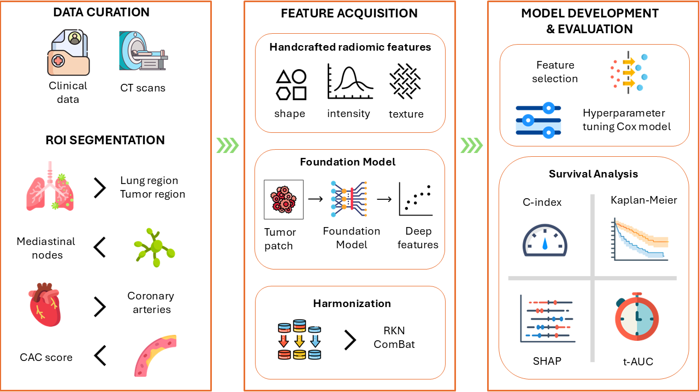

# CHAIMELEON - Lung cancer use case

## Overview

This project implements a comprehensive medical image analysis pipeline for non-small cell lung cancer (NSCLC) patients, focusing on multi-region feature extraction and survival prediction. The pipeline incorporates tumor segmentation, mediastinal node analysis, coronary artery analysis, and survival prediction techniques.

[Read the full paper on arXiv](https://arxiv.org/abs/2505.17893)

### Key Findings
- Successfully integrated features from multiple regions of interest (ROIs) including whole lung, tumor, mediastinal nodes, and coronary arteries
- Achieved improved survival prediction through harmonization techniques (ComBat, RKN)
- Best performing model: Foundation Model features with clinical data (C-index = 0.7616)
- Consensus model achieved 0.92 t-AUC with 97.6% sensitivity


*Workflow schematic showing the pipeline stages: (A) Multi-region segmentation using nnUNet and TotalSegmentator, (B) Feature extraction from different ROIs, (C) Feature harmonization and selection, and (D) Survival prediction models integration.*

## Project Structure

```
├── codes/                              # Analysis notebooks
│   ├── 1_nnUNetv2_predict.ipynb       # Segmentation predictions
│   ├── 2_extract_*_HRFs.ipynb         # Feature extraction
│   ├── 2_get_CAC_scores.ipynb         # Coronary calcium scoring
│   └── 3_OS_prediction_*.ipynb        # Survival prediction models
├── models/                             # Trained models
├── nnunet_input_images/               # Input CT images
├── preds_*/                           # Segmentation results
└── raw_images/                        # Original CT scans
```

## Prerequisites

- Python 3.10
- CUDA-compatible GPU
- Required Python packages:
  - nnUNetv2
  - TotalSegmentator
  - PyTorch
  - nibabel

## Installation

1. Create a new conda environment:
```bash
conda create -n nnunet python=3.10
conda activate nnunet
```

2. Install PyTorch:
```bash
pip3 install torch torchvision --index-url https://download.pytorch.org/whl/cu126
```

3. Install nnUNetv2:
```bash
pip install nnunetv2
```

4. Install TotalSegmentator:
```bash
pip install totalsegmentator
```
For detailed installation instructions and troubleshooting, visit the [TotalSegmentator GitHub repository](https://github.com/wasserth/TotalSegmentator?tab=readme-ov-file#installation).

5. Set up environment variables:
```bash
set nnUNet_raw=\path\to\project\nnUNet_raw
set nnUNet_preprocessed=\path\to\project\nnUNet_preprocessed
set nnUNet_results=\path\to\project\nnUNet_results
```

## Usage

### 1. Image Preprocessing and Segmentation

[`1_nnUNetv2_predict.ipynb`](codes/1_nnUNetv2_predict.ipynb)
- Preprocesses CT images into nnUNet-compatible format
- Performs automatic lung tumor segmentation using nnUNet (Dataset800_LUNGTUMOR)
- Segments mediastinal nodes using nnUNet (Dataset017_LNQ2023)
- Extracts coronary arteries using TotalSegmentator
- Generates segmentation masks for all regions of interest

### 2. Feature Extraction

Extract handcrafted radiomics features (HRFs) and calculate CAC scores:

[`2_extract_coronary_arteries_HRFs.ipynb`](codes/2_extract_coronary_arteries_HRFs.ipynb)
- Extracts texture and shape features from coronary arteries
- Implements PyRadiomics feature extraction pipeline

[`2_extract_mediastinal_nodes_HRFs.ipynb`](codes/2_extract_mediastinal_nodes_HRFs.ipynb)
- Extracts radiomics features from segmented lymph nodes
- Implements PyRadiomics feature extraction pipeline

[`2_extract_tumor_HRFs.ipynb`](codes/2_extract_tumor_HRFs.ipynb)
- Extracts radiomics features from segmented NSCLC 
- Implements PyRadiomics feature extraction pipeline

[`2_get_CAC_scores.ipynb`](codes/2_get_CAC_scores.ipynb)
- Calculates Agatston calcium scores
- Quantifies coronary calcification


### 3. Survival Analysis

Survival prediction models using different feature combinations:

[`3_OS_prediction_CA_texture.ipynb`](codes/3_OS_prediction_CA_texture.ipynb)
- Survival analysis using coronary artery texture features

[`3_OS_prediction_CAC_scoring.ipynb`](codes/3_OS_prediction_CAC_scoring.ipynb)
- Survival analysis using CAC scores

[`3_OS_prediction_MN_texture.ipynb`](codes/3_OS_prediction_MN_texture.ipynb)
- Survival analysis using mediastinal node texture features

[`3_OS_prediction_MN_volume.ipynb`](codes/3_OS_prediction_MN_volume.ipynb)
- Survival analysis using mediastinal node volumetric features

[`3_OS_prediction_tumor_texture.ipynb`](codes/3_OS_prediction_tumor_texture.ipynb)
- Survival analysis using tumor texture features

[`3_OS_prediction_tumor_volume.ipynb`](codes/3_OS_prediction_tumor_volume.ipynb)
- Survival analysis using tumor volumetric features

[`3_OS_prediction_whole_lung_texture.ipynb`](codes/3_OS_prediction_whole_lung_texture.ipynb)
- Survival analysis using whole lung texture features (TODO: add models and scalars)


## Downloading Required Models

All required models are available at: [Surfdrive Model Repository](https://surfdrive.surf.nl/s/nSfx2xNR3GTNEGN)

The repository contains two main folders:

### 1. Pre-trained CoxPH Survival Models (`models/`)
Cox Proportional Hazards (CoxPH) survival prediction models for different regions of interest (ROIs):
- `coronary_arteries_texture/`: CoxPH models for coronary artery texture features
- `CAC_scoring/`: CoxPH models using coronary artery calcium scores
- `mediastinal_nodes_texture/`: CoxPH models using lymph node texture features
- `mediastinal_nodes_volume/`: CoxPH models using lymph node volumetric features
- `tumor_texture/`: CoxPH models using tumor texture features
- `tumor_volume/`: CoxPH models using tumor volumetric features

These models are used in the corresponding `3_OS_prediction_*.ipynb` notebooks to predict overall survival based on different imaging biomarkers.

### 2. nnUNet Segmentation Models (`nnUNet_results/`)
The project uses two specific nnUNet models for segmentation:

1. **Mediastinal Node Segmentation (Dataset017_LNQ2023)**
   - Used for lymph node quantification
   - Extract to: `nnUNet_results/Dataset017_LNQ2023/`
   - Used in mediastinal nodes prediction with:
     ```bash
     nnUNetv2_predict -i INPUT_DIR -o OUTPUT_DIR -d 017 -c 3d_fullres -chk checkpoint_best.pth
     ```

2. **NSCLC Tumor Segmentation (Dataset800_LUNGTUMOR)**
   - Used for lung tumor segmentation
   - Extract to: `nnUNet_results/Dataset800_LUNGTUMOR/`
   - Used in tumor prediction with:
     ```bash
     nnUNetv2_predict -i INPUT_DIR -o OUTPUT_DIR -d 800 -c 3d_fullres
     ```

### Installation Steps:
1. Download all models from the Surfdrive link above
2. Extract the `models` folder to the root of your project directory
3. Extract the `nnUNet_results` folder to the root of your project directory
4. Verify the folder structure matches the project structure shown above

## License

For TotalSegmentator usage, a license key is required. Set it using:
```bash
totalseg_set_license -l your_license_key
```

## Notes

- Ensure sufficient GPU memory for running the segmentation models
- Input images should be in NIFTI format (.nii.gz)
- All paths in notebooks should be adjusted according to your local setup
